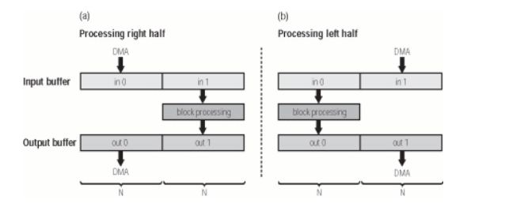

# STM32F4 Configuration: I2S Audio In / Out
My high resolution audio I/O configuration with STM32F4 Discovery board and Pmod I2S2 (24-bit, 96 KHz).

It uses a ping pong buffer audio stream, taking advantage of DMA in circular mode to continuously update 1/2 of a pair of buffers (input and output) completely independent of the CPU. So the other half of the input buffer is free to be processed, before being stored to the output buffer. At that point, another half-cicle occurs, with the input being filled again and the output being sent to the I2S peripheral data register.

The input data is converted to floating point values in the range of [-1, 1] to prepare it for any processing function, and then restored as 24-bit integer values.

More information about ping pong buffer on STM32 available [here](https://audiodsplab.wordpress.com/ping-pong-buffer-audio-stream/).

  <picture>
    
  </picture>

## Hardware used

| Shop | Description |
| --- | --- |
| [STM32F411E-DISCO Evalboard](https://www.mouser.it/ProductDetail/511-STM32F411E-DISCO) | STM32F4 microcontroller (Cortex M4 MCU, 32-bit), Discovery kit |
| [Digilent Pmod I2S2](https://www.mouser.it/ProductDetail/424-410-379) | Stereo 24-bit A/D and D/A converters for I2S audio input and output |
